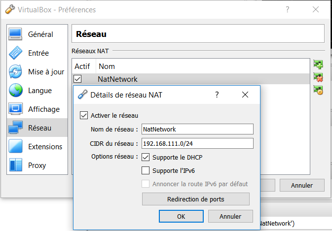

# TP4
***
   1909607 - Aminata Ndiaye

   1971729 - Gregoire Dervaux

   1973529 - Guillaume Kleinpoort

   1489757 - Patrick Nadeau
***
## Réseau
<a id="reseau"></a>
Comme nous allons devoir créer un flux de donnée entre différentes machines virtuelles, nous devons dans un premier temps créer un réseau privé virtuel.
Pour cela, nous allons utiliser VirtualBox ou VMware.
Pour cela, Telechargez VirtualBox [ici](https://www.virtualbox.org/wiki/Downloads), installez le, et lancer le logiciel.
Tout d'abord, nous allons créer une **réseau NAT**, d'adresse 192.168.111.0/24. (Fichier>>paramteres>>reseau>>Creer/modifier)



Ainsi, si nous utilisons ce réseau pour toutes les machines virtuelles, elles pourrons communiquer sans avoir à utiliser de router intermédiaire.
le réseau se décompose comme ceci:
+ l'**hôte** utilise le réseau quelconque auquel il est rattaché.
+ VirtualBox (ou VMware) jouera le rôle de **router** vers notre réseau virtuel
+ le **server TomCat** aura l'adresse **192.168.111.1**
+ le server de base de donnée **Cassandra** aura l'adresse **192.168.111.10**
+ la **grappe Spark** aura des adresses de la forme **192.168.111.2x**
    - *master*: *192.168.111.20*
    - *slave1*: *192.168.111.21*
    - *slave2*: *192.168.111.22*

Nous n'avons pas besoin de définir de port fowarding ici, il suffit de tout laisser passer.
Il peut être nécessaire de **désactiver le firewall** si il est actif sur les VM

> pour toutes les installations de logiciel, vous devez avoir un accès à intrenet.
Par default, le reseauNat ne donne pas cet accès.
Deux solution à ce problème:
+ vous utilisez le mode par default(NAT)pour installer les logiciels et ensuite vous redéfinisez vos adresses et la configuration du réseau
+ vous utilisez les adresses du réseau de la machine hôte en utilisant le mode "pont" ou "bridged". Cela donnera a votre VM une adresse sur le sous réseau de l'hôtable
Attention, ces adresses seront attribuées selon le server DHCP de votre router, vieillez à redéfinir chaques adresses de VM données si dessus
***

## Configuration du Client Postman
Nous utilisons pour client le logiciel Postman, qui permet de créer rapidement des requêtes HTTP, en spécifiant des entêtes et des corps de requêtes customisée.
Pour faciliter son utilisation, nous avons utilisé une Collection de requête qui se trouve sur le dépôt Github.
Nous utilisons deux principales requêtes
+ Une requête **GET**:
    - sur les produits
    - sur les factures
    - sur un Id de facture spécifié en paramêtre d'URL.
+ Une requête **POST**

```javascript
{
  factureId: <factureId>
  product: [
      {
        productId: <productId>,
        prix: <productPrice>,
        qte: <productQuantity>
      },
      {...}]
}
```
Pour configurer le client, il vous faut simplement lancer PostMan sur la machine host, et importer la collection.
Une fois la collection chargée, il vous suffit de selectionner l'onglet de la requête que vous voulez lancer, et cliquez sur *SEND*

> *PS:* Veuillez noter qu'il vous faudra modifier le corps de la requête POST si vous en faites plus d'une, car l'identifiant de la facture doit varier d'une facture à l'autre. Vous pouvez aussi modifier la quantité, le prix ou l'identifiant des produits tant que celui-ci existe

## Configuration des VM

Tout d'abord, il faut installer les Server sur les machine virtuel.
Telechargez un iso de [linux-Server](https://www.ubuntu.com/download/server).
Créez une nouvelle machine virtuelle avec virtualBox:
+ nom: \<nom de la vm\>
+ type: linux
+ version Ubuntu
> Pour toutes les machines virtuelles utilisées ici, 1 à 2G de mémoire vive sera largement suffisant, car elle ne présentent pas d'interface graphique. Attention, comme  nous allons lancer 5 VM en même temps, veuillez a ce que votre Ram ne satture pas. Si vous voulez donner 2G de ram a vos machines virtuelles, vous devez disposer d'au moins 16G de ram.

Nous devons maintenant configurer notre machine:
- Pour configurer l'OS:

  selectionnez votre MV dans la page d'accueil >> Configuration >> stockage >> Contrôleur: IDE >> Choississez un disque>>selectionnez l'image disque telechargée apparavant

- Pour configurer le réseau:

  selectionnez votre MV dans la page d'accueil >> Configuration >> Réseau >> Selectionnez le mode d'accès Réseau NAT >> Selectionnez le réseau "NatNetwork"

Lancez ensuite votre VM.

Selectionnez la langue, le clavier, puis une fois dans l'interface de configuration réseau, Selectionnez votre interface réseau.
> Dans la plupart des cas, il s'agit de enp0s3


Puis Edit IPv4 >> DHCP methode >> Manual
Spécifiez les champs suivants:
+ Subnet 192.168.111.0/24
+ Adress: 192.168.111.xxx
+ Gateway: 192.168.111.255
> remplacez 192.168.111.xxx par l'adresse de la machine décrite [ici](#reseau)

Selectionnez save, et continuez l'installation.

Une fois celle-ci terminée, redémarez la machine, identifiez vous pour obtenir une invite de commande.

## Server Web Tomcat

### Configuration

Dans un premier temps, créez une nouvelle VM appelée server_web_tomcat à l'adresse **192.168.111.1**

Vérifiez qu'elle possède bien la bonne adresse ip en tapant dans l'invite de commande:
```bash
$ ifconfig
```
installer ensuite le server TomCat via apt:

```bash
#on met a jour la liste des packets
$ sudo apt-get update
# on installe la dernière version du kit de developpement java
$ sudo apt-get install default-jdk
# on installe TomCat
$ sudo apt install tomcat9
# on demare le server tomcat:
$ sudo service tomcat8 start
```

### Service Web

Si ca n'est pas déjà fait, arretez le service tomcat:
```bash
$ sudo service tomcat9 stop
```

Telechargez depuis le dépôt github le dossier ```/tomcat/```
Copiez ce dossier dans ```/usr/local/tomcat/```
Et relancez le server
```bash
$ sudo service tomcat9 start
```
Pour vous assurez que le server est bien lancé, vous pouvez pinger cette adresse : **192.168.111.1:8080**.
> Si vous obtenez une erreur, référez vous à la [documentation Tomcat](http://tomcat.apache.org/tomcat-9.0-doc/)

## Base de donnée Cassandra

### Configuration

Tout d'abord, créez une nouvelle VM d'adresse **192.168.111.10**.

Ensuite, nous allons installer le server de base de donnée cassandra:

Si vous n'avez pas accès à une interface graphique:
```bash
# on installe la dernière version de java **Oracle**
# replace xxx by your version of jdk ou press tab just after "openjdk"
$ sudo apt-get purge openjdkxxx
$ sudo add-apt-repository ppa:webupd8team/java
$ sudo apt update
$ sudo apt install oracle-java8-installer
```
Sinon, Telechargez et installez la dernière version de Java [ici](https://download.oracle.com/otn-pub/java/jdk/11.0.1+13/90cf5d8f270a4347a95050320eef3fb7/jdk-11.0.1_linux-x64_bin.deb)

Ensuite
``` bash
# on ajoute l adresse du packet a la liste des apt
$ echo "deb http://www.apache.org/dist/cassandra/debian 36x main" | sudo tee -a /etc/apt/sources.list.d/cassandra.sources.list
# on ajoute les clefs
$ curl https://www.apache.org/dist/cassandra/KEYS | sudo apt-key add -
# rafraichissez la liste des packets disponibles
$ sudo apt-get update
# on installe Cassandra
$ sudo apt-get install cassandra
# on verifie que l'installation s'est bien dérouléel en lancant le Service
$ sudo service cassandra start
$ sudo service cassandra status
```
> Si vous obtenez une erreur, référez vous à la [documentation cassandra](http://cassandra.apache.org/doc/latest/)


### Service Web

Nous devons maitenant remplir la base de donnée.
Pour Cela, démarez la console cassandra:
```bash
$ cqlsh localhost
```
> Le firewall peut bloquer les port 9048 et 9160 utilisé par cassandra. Désactivez le ou autorisez les paquets sur ce port pour supprimer l'erreur de connexion:
```bash
$ sudo iptables -A INPUT -p tcp -m tcp --dport 9042 -j ACCEPT
$ sudo iptables -A INPUT -p tcp -m tcp --dport 9160 -j ACCEPT
$ sudo service iptables save
```

Vous devez obtenir cela:
```bash
Connected to Test Cluster at localhost:9042.
[cqlsh 5.0.1 | Cassandra 3.8 | CQL spec 3.4.2 | Native protocol v4]
Use HELP for help.
cqlsh> SELECT cluster_name, listen_address FROM system.local;

 cluster_name | listen_address
--------------+----------------
 Test Cluster |      127.0.0.1

(1 rows)
cqlsh>
```

Nous allons maintenant créer un KeySpace, une nouvelle table et des données

```sql
CREATE KEYSPACE KeySpace;

CREATE TABLE facture (
  fid int,
  pid set,
  qte set,
  );
CREATE TABLE produit (
  productId int PRIMARY KEY,
  pid int
  name text
  );


INSERT INTO produit JSON
[{"pid": 1,
  "name": "chaussette_noel"
},
{"pid": 2,
  "name": "chaussette_paques"
},
{"pid": 3,
  "name": "chaussette_anniversaire"
},
{"pid": 4,
  "name": "chaussette_nouvel_ans"
},
{"pid": 5,
  "name": "chaussette_velo"
},
{"pid": 6,
  "name": "chaussette_foot"
},
{"pid": 7,
  "name": "chaussette_skate"
},
{"pid": 8,
  "name": "chaussette_tennis"
},
{"pid": 9,
  "name": "chaussette_ski"
},
{"pid": 10,
  "name": "chaussette_course"
}];

INSERT INTO facture JSON
[{
  "fid": 1,
  "pid": 1,
  "qte": 3
},
{
  "fid": 1,
  "pid": 2,
  "qte": 1
},
{
  "fid": 1,
  "pid": 6,
  "qte": 1,
},
{
  "fid": 2,
  "pid": 1,
  "qte": 2
},
{
  "fid": 2,
  "pid": 2,
  "qte": 3
},
{
  "fid": 2,
  "pid": 10,
  "qte": 3
},
{
  "fid": 4,
  "pid": 5,
  "qte": 2
},
{
  "fid": 4,
  "pid": 4,
  "qte": 10
},
{
  "fid": 5,
  "pid": 1,
  "qte": 3
},
{
  "fid": 5,
  "pid": 2,
  "qte": 3
},
{
  "fid": 6,
  "pid": 8,
  "qte": 3
},
{
  "fid": 1,
  "pid": 1,
  "qte": 3
}];
```

Le server de base de donnée est maintenant actif !
